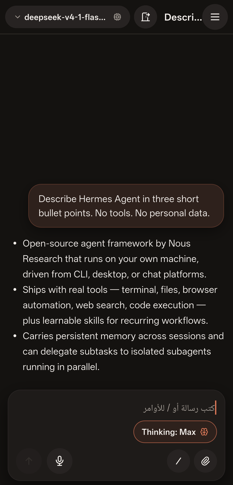
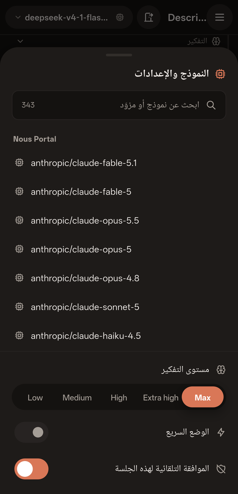
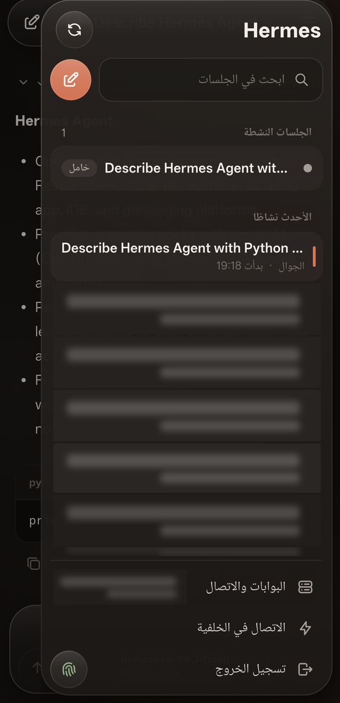

# Hermes Mobile — Android Remote Gateway for Hermes Agent

**Your self-hosted Hermes Agent, on your Android phone.** An independent Flutter client for streaming conversations, session management, model selection, attachments, steering and queued follow-ups over a private **Tailscale** connection.

<a href="https://github.com/karem505/hermes-mobile-remote-gateway/releases/latest/download/hermes-mobile-android-arm64.apk"></a>

[Latest release & checksums](https://github.com/karem505/hermes-mobile-remote-gateway/releases/latest) · [Tailscale setup](docs/TAILSCALE.md) · [Build from source](docs/BUILDING.md) · [Report an issue](https://github.com/karem505/hermes-mobile-remote-gateway/issues)


[](https://github.com/karem505/hermes-mobile-remote-gateway/actions/workflows/android.yml)
[](LICENSE)

> **Community project, not an official Nous Research app.** [Hermes Agent](https://github.com/NousResearch/hermes-agent) is created by **[Nous Research](https://github.com/NousResearch)**, **[Teknium](https://github.com/teknium1)** and the [Hermes Agent contributors](https://github.com/NousResearch/hermes-agent/graphs/contributors). This repository provides the Android client, not the agent itself. If you like this app, please support and star the original project.

## Screenshots

Real captures from an Android phone, not mockups. Private session titles and device-status details are obscured; original unredacted captures are not published. The app currently uses **Arabic RTL UI**, with model names and Thinking levels in English. Repository documentation is in English.

<p>
  
  
  
</p>

## What you can do

- **Chat with your own agent:** streaming text, reasoning sections and tool activity.
- **Manage sessions:** create, search, reopen and close sessions on the connected server.
- **Choose models:** searchable model picker, English Thinking levels and explicit confirmation when the server warns about a context-sensitive or expensive switch.
- **Stay in control:** stop, steer an active turn, or queue a follow-up. Attachments belong to the specific turn, not a later draft.
- **Work with files:** attach files/images, preview received images and download/open generated files.
- **Dictate prompts:** microphone recording with transcription through your configured backend.
- **Keep work visible:** Android foreground connection service and local completion notifications while the process is alive.
- **Watch background work:** a live panel above the composer lists long-running `terminal(background=true)` processes and delegated subagents for the open session, streams their output, and lets you stop a running one or dismiss a finished one.
- **Connect privately:** use your own Hermes host through Tailscale; no public port forwarding is required.
- **Sign in securely:** credentials stored with Flutter Secure Storage; optional biometric app unlock.

## Download and install

1. Tap **Download APK** above, or open [Releases](https://github.com/karem505/hermes-mobile-remote-gateway/releases).
2. Download `hermes-mobile-android-arm64.apk` for an ARM64 Android device.
3. If requested, allow installation from the browser/file manager you used. Review Android's installation prompt.
4. Install [Tailscale for Android](https://tailscale.com/download/android) and connect it to the same tailnet as your Hermes host.
5. Follow the [complete Tailscale and Hermes setup guide](docs/TAILSCALE.md), then enter your server URL and Hermes username/password in the app.

The release includes `SHA256SUMS.txt`. See [build and signing notes](docs/BUILDING.md) to verify the download or compile it yourself. No Play Store listing or iOS build is provided. Development-signed Actions artifacts are for testing, **not** upgrades to the signed Release APK.

## How it works

```text
Android phone                    Your computer / server
Hermes Mobile  ── Tailscale ──>   hermes serve
  Flutter UI                      authenticated HTTP + WebSocket gateway
  foreground service              Hermes Agent + your models, tools and files
```

The app uses password login, a session cookie, a single-use WebSocket ticket and JSON-RPC over `/api/ws`. The AI agent runs on your host, not on the phone. Model credentials remain a backend concern; do not paste provider API keys into the app's password field.

**Tailscale provides the private network; Hermes authentication still protects the application.** For a direct connection, use the host's tailnet address and port. Tailscale Serve can add tailnet-only HTTPS. Tailscale **Funnel** is a different feature that exposes a service publicly and is not needed here.

Start with [Tailscale setup](docs/TAILSCALE.md), including MagicDNS, authentication, permissions, HTTPS, background operation and troubleshooting.

## Requirements and compatibility

- Android **7.0+ (API 24+)**, ARM64. Minimum API verified from the release APK manifest; real-device testing was on Android 16, not every supported OS version.
- A reachable Hermes Agent installation with `hermes serve`, password authentication, `/api/auth/ws-ticket` and `/api/ws`.
- Tailscale on both devices, with an access policy allowing the selected gateway port.
- A model/provider configured on the Hermes host.
- Tested development environment: Flutter **3.47.5**, Dart **3.13.4**, JDK **17**.
- Backend development baseline: Hermes source revision `c07501ec411b5364e5b12b7258c25a6a4c758545`. Compatibility with every upstream release is not guaranteed; check `hermes serve --help` and the [official docs](https://hermes-agent.nousresearch.com/docs/).

## Current limits

- This is an early community release. Arabic RTL is the current app UI; English app localization is not implemented.
- Background notifications are **local Android notifications**, not FCM/cloud push. Force-stop, reboot, OEM battery restrictions or a disconnected VPN can interrupt delivery.
- A short real-device background test observed the same running process, a foreground service and a completion notification. It does not prove hours-long Doze reliability.
- Session sharing requires clients to use the **same backend/profile**. A separate Desktop backend is not automatically synchronized.
- Files are processed by your host and its selected model/tools. Review your provider's data policy; not all models can interpret images.
- The app permits HTTP for private-tailnet deployments. Do not send credentials over an untrusted plain-HTTP LAN or public endpoint; use tailnet-only HTTPS where possible.

## Development

```sh
git clone https://github.com/karem505/hermes-mobile-remote-gateway.git
cd hermes-mobile-remote-gateway
flutter pub get
flutter analyze --no-pub
flutter test
flutter build apk --release --target-platform android-arm64
```

[Building and release signing](docs/BUILDING.md) · [Contributing](CONTRIBUTING.md) · [Security](SECURITY.md) · [Changelog](CHANGELOG.md)

GitHub Actions runs analysis and tests, builds an Android APK and attaches a development-signed APK artifact to the workflow run. Stable, maintainer-signed downloads live in **Releases**, linked by the download button at the top.

## Credits and license

- **Hermes Agent:** [Nous Research](https://github.com/NousResearch), [Teknium](https://github.com/teknium1) and [all upstream contributors](https://github.com/NousResearch/hermes-agent/graphs/contributors). Original repository: **[NousResearch/hermes-agent](https://github.com/NousResearch/hermes-agent)**.
- **Android client:** maintained by [Karem](https://github.com/karem505).
- Built with Flutter/Dart, Tabler Icons and the open-source packages in `pubspec.yaml`. Their licenses remain their own.
- Hermes name and related artwork identify the upstream project; no affiliation, sponsorship or endorsement is claimed. Trademark rights are not granted by this repository's code license.

Client code: [MIT](LICENSE). Upstream Hermes Agent MIT notice: [THIRD_PARTY_NOTICES.md](THIRD_PARTY_NOTICES.md).
