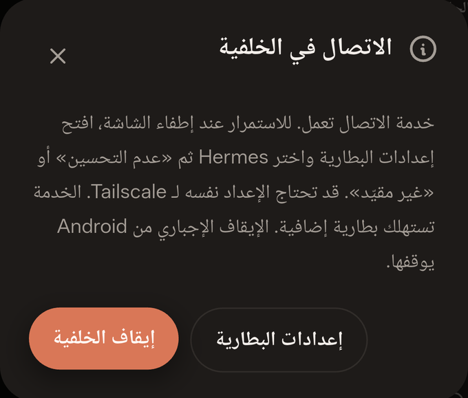

# Connect Hermes Mobile over Tailscale

This guide connects an Android phone to **your own Hermes Agent host** without opening a router port. Examples use placeholders; never copy another person's tailnet hostname or credentials.

## 1. Prepare the Hermes host

Install and configure Hermes Agent using the [official documentation](https://hermes-agent.nousresearch.com/docs/). Run `hermes setup`, choose a provider/model and confirm a normal agent conversation works locally. Then check:

```sh
hermes serve --help
hermes serve --status
```

The mobile client needs the authenticated gateway, not just a messaging bot or an OpenAI-compatible inference proxy. Required endpoints are `/auth/password-login`, `/api/auth/ws-ticket` and `/api/ws`.

The app's direct-connection default is **9131**; upstream Hermes normally defaults to **9119**. Always pass your chosen port explicitly and use the same one in the app. If another Hermes backend already serves this machine, use that backend where appropriate rather than starting a conflicting listener. Separate profile-scoped instances may require `--isolated`; consult your installed CLI help. Do not stop a backend other clients are using.

## 2. Put both devices on your tailnet

1. Install [Tailscale on the host](https://tailscale.com/download) and [on Android](https://tailscale.com/download/android).
2. Sign in to the same tailnet, or use an explicitly authorized shared node.
3. On Android, approve the system VPN request and keep Tailscale connected. Another VPN can displace Tailscale.
4. On the host, inspect connectivity:

```sh
tailscale status
tailscale ip -4
```

Copy **your** host's Tailscale IP or full MagicDNS name from the admin console. These are not your Wi-Fi `192.168.x.x` address and not your public WAN address. See [MagicDNS](https://tailscale.com/kb/1081/magicdns).

## 3. Configure Hermes password authentication

This app currently uses the bundled **username/password** authentication provider. OAuth-only deployments are not supported by its login screen. Tailscale login is not a replacement for Hermes login.

Follow the upstream [dashboard authentication guide](https://hermes-agent.nousresearch.com/docs/user-guide/features/web-dashboard). Dashboard and `hermes serve` share the backend authentication system. Current upstream supports these variables in the active Hermes environment file:

```dotenv
HERMES_DASHBOARD_BASIC_AUTH_USERNAME=your-chosen-username
HERMES_DASHBOARD_BASIC_AUTH_PASSWORD=REPLACE_WITH_A_UNIQUE_STRONG_PASSWORD
HERMES_DASHBOARD_BASIC_AUTH_SECRET=REPLACE_WITH_A_RANDOM_STABLE_SIGNING_SECRET
```

- Edit the **active profile's** private environment file on the host, not this repository. Never commit it.
- Generate a signing secret locally, for example with `openssl rand -base64 32`. Keep it stable so logins survive a restart.
- Restrict the environment file to its owner (`chmod 600` on Unix).
- Prefer the password-hash configuration supported by upstream when provisioning a persistent service; see the upstream guide for the current setup flow.
- Ensure the bundled `basic` auth provider is enabled. Do not use `--insecure`: current upstream treats it as a deprecated no-op, not a valid authentication bypass.
- After changing authentication, restart only the backend you own, at an appropriate time.

## 4. Direct connection: bind to the Tailscale interface

On a Linux host with Tailscale active:

```sh
hermes serve --host "$(tailscale ip -4)" --port 9131
```

Binding to the tailnet interface avoids listening on every LAN/public interface. Keep the machine awake and the process running. If the host has a firewall, allow incoming TCP **9131 only through `tailscale0`** (or the equivalent interface for your platform); do not open it globally.

In Hermes Mobile enter:

```text
http://YOUR_TAILSCALE_IP:9131
```

Then enter the **Hermes** username and password from step 3. The app requests a cookie, obtains a WebSocket ticket and waits for `gateway.ready` before showing a connected state.

For this direct route, HTTP/WebSocket traffic travels **inside Tailscale's encrypted tunnel**. It is not standalone HTTPS: never reuse this plain-HTTP pattern on an untrusted/public network. If a full MagicDNS hostname is rejected by the backend's Host-header guard, use the exact Tailscale IP you bound to, or configure the public URL/HTTPS route below. Never disable the host guard as a workaround.

## 5. Optional: tailnet-only HTTPS with Tailscale Serve

Use this deployment shape if you prefer HTTPS and a MagicDNS hostname:

```text
Phone -> HTTPS over tailnet -> Tailscale Serve -> 127.0.0.1:9131 -> Hermes
```

1. Configure password authentication first.
2. Set Hermes's browser-facing origin to the **exact URL Tailscale assigns your host**:

```sh
hermes config set dashboard.public_url 'https://YOUR_HOST.YOUR_TAILNET.ts.net'
hermes serve --host 127.0.0.1 --port 9131
```

3. In a separate terminal, configure Tailscale Serve (subject to your tailnet permissions):

```sh
tailscale serve --bg http://127.0.0.1:9131
tailscale serve status
```

Tailscale may ask you to enable HTTPS certificates for the tailnet. Review that prompt; certificate-transparency records can expose certificate hostnames. See [Tailscale HTTPS](https://tailscale.com/kb/1153/enabling-https).

4. Use the resulting HTTPS hostname in the app with an **explicit port 443**:

```text
https://YOUR_HOST.YOUR_TAILNET.ts.net:443
```

**Why explicitly `:443`?** This version's login screen appends `:9131` when no port is provided, including to an HTTPS URL. Supplying `:443` avoids that default. Do not add `/api/ws` or a dashboard path to the server URL.

Keep the proxy on the origin root and preserve cookies and WebSocket upgrades. `dashboard.public_url` is important for authentication and host validation even though Hermes listens on loopback. Confirm `/api/status` advertises `auth_required` and the `basic` provider before relying on the deployment. Do not assume loopback binding alone secures a reverse-proxied service.

This HTTPS route is documented from upstream Hermes and Tailscale guidance; the real-device development checks used the **direct tailnet connection**, not an end-to-end Tailscale Serve deployment.

**Serve is not Funnel.** Serve shares inside your tailnet. [Funnel](https://tailscale.com/kb/1223/funnel) exposes a service to the public internet. This project does not require Funnel, a public DNS record or router port forwarding. Do not enable Funnel for this setup.

## 6. Restrict access

Use Tailscale grants/ACLs to allow only intended users/devices to the host and port. The app needs TCP **9131** for direct access, or **443** for Serve HTTPS. A tailnet can be permissive by default; being on Tailscale does not automatically mean only your phone is authorized. Consult [Tailscale access control](https://tailscale.com/kb/1018/acls) and test the policy in your admin console before applying it.

Treat access to Hermes as access to a powerful agent with host tools and files. Do not share the app's Hermes credentials. Use isolated profiles/accounts where appropriate. Provider keys, passwords, cookies, WebSocket tickets and signing keys must stay out of screenshots, logs and issues.

## 7. Background operation



- Allow Hermes notification permission when prompted.
- The foreground service has an ongoing connection notification and a stop action.
- If your Android vendor suspends the app, review its battery settings for **both Hermes and Tailscale**. Do not disable device-wide battery protections unnecessarily.
- Keep the host awake, connected and running Hermes. A user service/process supervisor can keep the backend running; configure it for the correct profile and private environment file.
- Closing the UI is different from force-stopping the app. Force-stop can end the engine and notifications; reopen to reconnect.
- Completion notifications are local, not FCM push. No always-delivered or reboot-survival guarantee is made.

## Troubleshooting

- **Cannot connect:** confirm Tailscale is connected on both devices, the host is awake, the port matches and the access policy permits it. Check `tailscale status`, `tailscale ping YOUR_HOST` and `hermes serve --status`. A successful Tailscale ping alone does not prove the application port is open.
- **IP works, name does not:** check MagicDNS and Android's DNS/VPN settings. Try the exact Tailscale IP used in `--host`; check Hermes Host-header/public URL validation.
- **401 / login rejected:** use Hermes credentials, not the Tailscale account password. Confirm the `basic` provider and active profile. Do not paste logs containing cookies/passwords.
- **HTTP works but gateway never connects:** ensure the reverse proxy passes WebSocket upgrades and `/api/auth/ws-ticket` succeeds. Check the backend log for protocol errors.
- **HTTPS tries port 9131:** use an explicit `:443` as described above.
- **Disconnected in background:** inspect OEM battery restrictions, VPN connectivity and the host's sleep policy. Reopen the app; non-idempotent requests are not blindly replayed.
- **Missing Desktop sessions:** make sure both clients use the same backend and profile. An isolated server and a separate Desktop server do not automatically share live sessions.
- **Attachment cannot be read:** confirm the file exists on the connected host, permissions allow access and the selected model/tools support it.

## References

- [Hermes Agent documentation](https://hermes-agent.nousresearch.com/docs/)
- [Hermes dashboard, authentication and remote access](https://hermes-agent.nousresearch.com/docs/user-guide/features/web-dashboard)
- [Tailscale Serve overview](https://tailscale.com/kb/1152/tailscale-serve)
- [Tailscale Serve CLI](https://tailscale.com/kb/1242/tailscale-serve)
- [MagicDNS](https://tailscale.com/kb/1081/magicdns)
